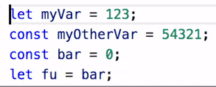
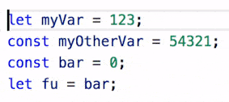
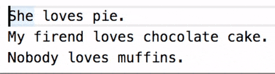

# cursor-align

Aligns all of the cursors/selections into a vertical line by inserting spaces. A very simple, quick, easy, and agnostic way to align code/text however you want.

## Features

### Cursor Align

---

### Selection Align

---

---

## Extension Commands

 Command                           | Key Binding
-----------------------------------|-------------
`yo1dog.cursor-align.alignCursors` | `alt+a`

## Implementation Details

**Note:** A "cursor" is actually a selection with a length of 0.

Inserts spaces to the left of selections until all the selection starts are aligned with the right-most selection start. Adds spaces to the end of selections until all selections are the same length as the longest selection (all section ends are aligned with the right most selection end).

### Caveats

Multiline selections don't make much sense with this tool, but here's how they are handled: A multiline selection is split into two 0-length selections with one at the starting point and one at the end point of the multiline selection.

Likewise, multiple selections per line don't make much sense, but here's how they are handled: Multiple selections per line are combined into a single selection that starts at the left-most selection's starting point and ends at the right-most selection's end point.

## Known Issues

- Selections behave unexpectedly when undoing and redoing.

See [Issues](https://github.com/yo1dog/vscode-cursor-align/issues).

## Release Notes

See [CHANGELOG.md](CHANGELOG.md)