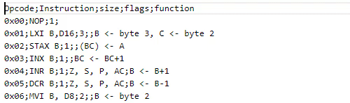

# cursor-align

Aligns all of the cursors/selections into a vertical line by inserting spaces. A very simple, quick, easy, and agnostic way to align code/text however you want.

## Features

### Cursor Align

### Selection Align

### Table Align

## Extension Commands

 Command                           | Description
-----------------------------------|-------------
`yo1dog.cursor-align.alignCursors` | Aligns all cursors/selections.

## Implementation Details

**Note:** A "cursor" is actually a selection with a length of 0.

For each line with selections is marked the positions of the start and end of each selection. Next is inserted spaces at the left of the first marked position of each line until all the first positions are align. Repeat the same for the second positions, and so on.

### Caveats

Multiline selections don't make much sense with this tool, but here's how they are handled: A multiline selection is split into two 0-length selections with one at the starting point and one at the end point of the multiline selection.

## alt+a Not Working?

If instead of aligning cursors a character is inserted or nothing happens, the default `alt+a` keybinding may be being caught higher up (ex: at the OS level). Try changing the keybinding.

If you continue to have problems, please open a new issue [here](https://github.com/yo1dog/vscode-cursor-align/issues).

## Known Issues

See [Issues](https://github.com/yo1dog/vscode-cursor-align/issues).

## Release Notes

See [CHANGELOG.md](CHANGELOG.md)