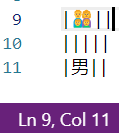

# cursor-align

Aligns all of the cursors/selections into a vertical line by inserting whitespace. A very simple, quick, easy, and agnostic way to align code/text however you want.

Spaces are used by default, but tabs can also be used. The "auto" version will automatically use tabs or spaces based on your indentation settings. Consider rebinding the default `alt+a` keybinding to whichever you prefer.

## Extension Commands

 Command                                    | Description
--------------------------------------------|-------------
`yo1dog.cursor-align.alignCursors`          | Aligns all cursors/selections using spaces.
`yo1dog.cursor-align.alignCursorsUsingTabs` | Aligns all cursors/selections using tabs.
`yo1dog.cursor-align.alignCursorsUsingAuto` | Aligns all cursors/selections using either spaces or tabs based on the current indentation settings.

## Implementation Details

**Note:** A "cursor" is actually a selection with a length of 0.

Inserts whitespace to the left of selections until all the selection starts are aligned with the right-most selection start. Adds whitespace to the end of selections until all selections are the same length as the longest selection.

If there are multiple selections per line. Selections are grouped into columns from left to right. All selections within a column are aligned with each other.

If tabs are used for alignment, the start and end of all selections are aligned with tab stops.

### Caveats

Multiline selections don't make much sense with this tool. As such they are ignored.

## alt+a Not Working?

If instead of aligning cursors a character is inserted or nothing happens, the default `alt+a` keybinding may be being caught higher up (ex: at the OS level). Try changing the keybinding.

If you continue to have problems, please open a new issue [here](https://github.com/yo1dog/vscode-cursor-align/issues).

## Known Issues

See [Issues](https://github.com/yo1dog/vscode-cursor-align/issues).

### Why are extra tabs being inserted?

Aligning using tabs is a bit more complicated than spaces due to the requirement that tabs must start and end at tab stops in order to be aligned. As such, in some scenarios it may seem as though unneeded tabs are being inserted. However, these tabs are indeed necessary to ensure the rule "the start and end of all selections are aligned with tab stops."

### Emojis/nonstandard characters mess up alignment.

This is due to an underlying issue with vscode: https://github.com/microsoft/vscode/issues/100730

There is no way to know how wide a character will be when displayed in vscode. It is completely up to the render engine with many environmental variables involved (font, ligatures, grapheme clustering, etc.). A character may even have a fractional width! Thus, there are some scenarios that are simply impossible to align correctly.

For example, this emoji 👨‍👩‍👦‍👦 is actually 7 characters: `U+1F468` `U+200D` `U+1F469` `U+200D` `U+1F466` `U+200D` `U+1F466`. In vscode, placing the cursor after this emoji advances the column position by 7, indicating that it would take up the width of 7 characters. However, visually the emoji spans about 2.2 characters.

On the flip side, the Japanese Kanji for man 男 is the single character `U+7537`, advances the cursor column position by 1, yet visually spans about 1.9 columns.

## Release Notes

See [CHANGELOG.md](CHANGELOG.md)