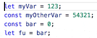
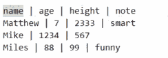
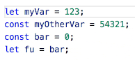
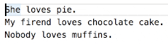

# cursor-align

Aligns all of the cursors/selections into a vertical line by inserting spaces. A very simple, quick, easy, and agnostic way to align code/text however you want.

## Extension Commands

 Command                           | Description
-----------------------------------|-------------
`yo1dog.cursor-align.alignCursors` | Aligns all cursors/selections.

## Implementation Details

**Note:** A "cursor" is actually a selection with a length of 0.

Inserts spaces to the left of selections until all the selection starts are aligned with the right-most selection start. Adds spaces to the end of selections until all selections are the same length as the longest selection (all section ends are aligned with the right most selection end).

If there are multiple selections per line. Selections are grouped into columns from left to right. All selections within a column are aligned with eachother.

### Caveats

Multiline selections don't make much sense with this tool. As such they are ignored.

## alt+a Not Working?

If instead of aligning cursors a character is inserted or nothing happens, the default `alt+a` keybinding may be being caught higher up (ex: at the OS level). Try changing the keybinding.

If you continue to have problems, please open a new issue [here](https://github.com/yo1dog/vscode-cursor-align/issues).

## Known Issues

See [Issues](https://github.com/yo1dog/vscode-cursor-align/issues).

## Release Notes

See [CHANGELOG.md](CHANGELOG.md)